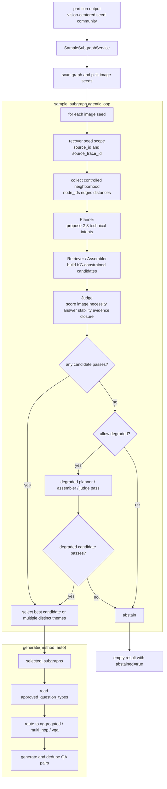
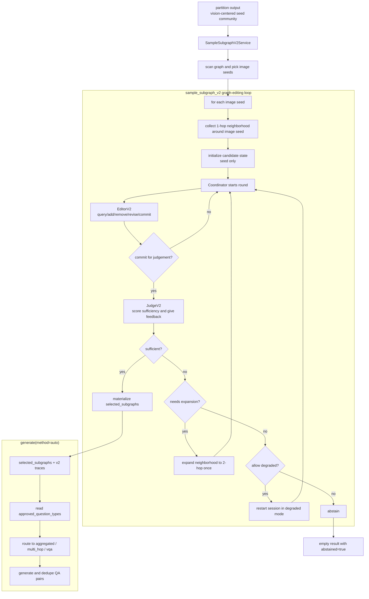

# Agentic Subgraph Sampler

## 导读

本文说明当前两条 agentic subgraph sampling 链路：

```text
partition -> sample_subgraph -> generate(method=auto)
partition -> sample_subgraph_v2 -> generate(method=auto)
```

它们都面向技术文档图像，只是内部策略不同：

- `sample_subgraph`
  - 当前稳定的 `v1 baseline`
  - 采用 `Planner -> Retriever / Assembler -> Judge` 的单轮候选构图
- `sample_subgraph_v2`
  - 新的 graph-editing agent
  - 采用 `Coordinator + Editor + Judge` 的状态式编辑回路

设计目标是：

- 以 `image seed` 为中心
- 从现有融合 KG 里严格选择节点和边
- 构出一个或少量高质量、强图像依赖的显式子图
- 再基于该子图生成高质量技术 VQA

它主要服务这类数据：

- JEDEC / DRAM spec
- timing diagram
- architecture/block diagram
- table-as-image
- 其他技术密集型图文材料

## 1. 它在 pipeline 里的位置

对应配置见：

- `examples/generate/generate_vqa/agentic_subgraph_reasoning_config.yaml`
- `examples/generate/generate_vqa/agentic_subgraph_reasoning_v2_config.yaml`

完整链路可以走两种变体：

```text
read
-> structure_analyze
-> hierarchy_generate
-> tree_construct
-> tree_chunk
-> build_grounded_tree_kg
-> partition(anchor_bfs, image/table)
-> sample_subgraph
-> generate(method=auto)
```

```text
read
-> structure_analyze
-> hierarchy_generate
-> tree_construct
-> tree_chunk
-> build_grounded_tree_kg
-> partition(anchor_bfs, image/table)
-> sample_subgraph_v2
-> generate(method=auto)
```

各阶段职责分成两层：

- `partition`
  - 只负责给出一个 vision-centered 的初始 seed community
- `sample_subgraph`
  - `v1` 围绕 image seed 做单轮 candidate construction
  - 产出显式 artifact，而不是直接出题
- `sample_subgraph_v2`
  - `v2` 围绕 image seed 做 graph-editing agent search
  - 产出显式 artifact，而不是直接出题
- `generate(method=auto)`
  - 消费 `selected_subgraphs`
  - 根据 question type 自动选择合适 generator

换句话说，真正决定“最终拿哪个子图来出题”的阶段是 `sample_subgraph` / `sample_subgraph_v2`。

## 2. 实现结构

`v1` 对应代码：

- `graphgen/models/subgraph_sampler/agentic_vlm_sampler.py`
- `graphgen/models/subgraph_sampler/artifacts.py`
- `graphgen/models/subgraph_sampler/prompts.py`
- `graphgen/models/subgraph_sampler/constants.py`
- `graphgen/operators/sample_subgraph/sample_subgraph_service.py`

`v2` 对应代码：

- `graphgen/models/subgraph_sampler/graph_editing_vlm_sampler.py`
- `graphgen/models/subgraph_sampler/v2_artifacts.py`
- `graphgen/models/subgraph_sampler/v2_prompts.py`
- `graphgen/operators/sample_subgraph_v2/sample_subgraph_v2_service.py`
- `graphgen/operators/generate/generate_service.py`

其中职责拆分如下：

- `agentic_vlm_sampler.py`
  - `v1` orchestration、neighborhood 收集、candidate 选优
- `graph_editing_vlm_sampler.py`
  - `v2` coordinator loop、stateful graph editing、judge-driven stopping
- `artifacts.py`
  - `v1` 的结构化 schema、JSON payload 解析、基础清洗
- `v2_artifacts.py`
  - `v2` 的 editor action、candidate state、judge feedback、session trace
- `prompts.py`
  - `v1` planner / assembler / judge 的 prompt 渲染
- `v2_prompts.py`
  - `v2` editor / judge 的 prompt 渲染
- `constants.py`
  - 放 question family 和技术关键词常量

### 2.1 V1 角色

- `Planner`
  - 看 image seed、seed metadata、seed 周边 KG 证据
  - 提出 2-3 个“值得构图”的技术意图
- `Retriever / Assembler`
  - 只从现有 KG 中选择节点和边
  - 为每个意图组装一个 candidate subgraph
- `Judge`
  - 对每个 candidate 做结构化打分
  - 决定通过、拒绝，还是走 degraded path

### 2.2 V2 角色

- `Coordinator`
  - 控制回合、扩图、degraded fallback、停止条件和最终提交
- `Editor`
  - 对 candidate subgraph state 执行显式图编辑动作
- `Judge`
  - 对当前 state 做结构化验收，并返回下一轮可用反馈

### 2.3 输出 artifact

两条链路最终都会输出兼容 `generate(method=auto)` 的 artifact，核心字段包括：

- `seed_node_id`
- `seed_image_path`
- `selection_mode`
- `degraded`
- `degraded_reason`
- `selected_subgraphs`
- `candidate_bundle`
- `abstained`

`v2` 还会额外输出：

- `sampler_version`
- `agent_session`
- `candidate_states`
- `edit_trace`
- `judge_trace`
- `neighborhood_trace`
- `termination_reason`

### 2.4 生成阶段如何衔接

`GenerateService(method=auto)` 现在会优先读取：

- `selected_subgraphs[*].nodes`
- `selected_subgraphs[*].edges`
- `selected_subgraphs[*].approved_question_types`
- `selected_subgraphs[*].degraded`

也就是说：

- 选图由 agent artifact 决定
- 出题由 downstream generator 决定
- 最终结果里会显式带 `generator_key`
- `task_type` 只是 `generator_key` 的镜像字段，便于旧下游继续读取

## 3. V1 整体执行逻辑

从实现角度看，`sample_subgraph` 的主流程可以概括成下面这几步。

### 3.0 流程图



### 3.1 找 image seed

`SampleSubgraphService.process()` 会加载全局 graph storage，扫描所有节点，只把 image-like 节点当成 seed：

- `entity_type` 包含 `IMAGE`
- 或 metadata 里带 `image_path` / `img_path`

当前 v1 重点是 `image seed`，不是所有 `table` seed。

### 3.2 恢复 seed scope，并收集 neighborhood

因为当前图是融合图，不是按文档隔离的图，所以不能直接把所有近邻都当成可用上下文。

实现会先恢复 seed 的 source scope：

- `node.source_id`
- `metadata.source_trace_id`

然后基于这个 scope，从 seed 出发做受控 BFS，得到一个 neighborhood：

- `node_ids`
- `edges`
- `distances`

这个 neighborhood 就是后续 planner / assembler / judge 共享的候选空间。

关键点：

- 仍然保留“同源优先”的约束
- neighborhood 是共享候选空间，不预先切成固定子结构
- agent 在这个空间里自行选择最终 candidate 所需证据

### 3.3 Planner：提出 candidate intents

Planner 的输入包括：

- seed node id
- seed description
- image path
- neighborhood 摘要
- 当前允许的 question family
- 是否处于 degraded mode

Planner 输出的是若干 intent，例如：

- 围绕 timing constraint 构图
- 围绕 architecture relation 构图
- 围绕 parameter comparison 构图

每个 intent 会带：

- `intent`
- `technical_focus`
- `question_types`
- `priority_keywords`

默认最多生成 `candidate_pool_size=3` 个 intent。

### 3.4 Retriever / Assembler：为每个 intent 组装 candidate subgraph

Assembler 的约束非常严格：

- 只能使用 neighborhood 里已有的 `node_ids`
- 只能使用已有的 `edge_pairs`
- 不能创造新节点
- 不能自由补边
- 必须满足 size budget

Assembler 输出的 candidate 至少包含：

- `candidate_id`
- `intent`
- `technical_focus`
- `node_ids`
- `edge_pairs`
- `approved_question_types`
- `image_grounding_summary`
- `evidence_summary`
- `degraded`

这里的 `image_grounding_summary` 很重要，它明确解释：

“为什么这道题如果不看图，就不应该稳定答出来”

### 3.5 Judge：结构化打分并决定通过 / 拒绝

Judge 不再只给一个抽象总分，而是输出显式 rubric：

- `image_indispensability`
- `answer_stability`
- `evidence_closure`
- `technical_relevance`
- `reasoning_depth`
- `hallucination_risk`
- `theme_coherence`
- `overall_score`
- `passes`

其中 pass gate 主要要求：

- 图像是必要的，而不是可有可无
- 答案是稳定的，不是猜测性的
- 图与子图内证据能闭合
- 技术主题是明确而一致的
- hallucination risk 不能太高

如果某个 candidate 没过线，Judge 会给：

- `decision = rejected`
- `rejection_reason`

### 3.6 Primary 失败时走 degraded path

如果 primary candidates 全部失败，而且 `allow_degraded=true`，就会再跑一轮 degraded intent / candidate / judge。

degraded 的含义不是“放宽事实标准”，而是：

- 题型更保守
- 推理链更短
- 更接近技术图表的直接解读

但它仍然必须满足：

- 依赖图像
- 答案稳定
- 证据闭合

如果 degraded 也失败，就直接 `abstained = true`，不强行产出低质量样本。

### 3.7 从 accepted candidates 中选 final subgraph

只要有 candidate 通过 Judge，系统就会进入 selection 阶段。

默认策略是：

- 优先保留一个最优 candidate
- 如果 `max_selected_subgraphs > 1`
- 且多个 candidate 主题足够分离
- 且 overlap 不高
- 才允许进入 `selection_mode = multi`

所以默认输出通常是：

- `selection_mode = single`
- `selected_subgraphs` 里只有 1 个 subgraph

只有图中明显存在多个独立技术主题时，才会保留多个 selected subgraph。

## 4. V2 整体执行逻辑

`sample_subgraph_v2` 不再一次性拼出 candidate，而是在一个候选子图状态上做显式编辑。

### 4.0 流程图



### 4.1 初始 neighborhood

`v2` 的初始 neighborhood 不再使用 `same source_id` 作为硬门槛，而是：

- 以 `image seed` 为中心
- 从 seed 的直接图邻居开始，也就是 `1-hop`
- 必要时再扩到 `2-hop`
- provenance 只作为 guardrail，用来拦明显跨文档噪声

当前假设是：image chunk 已经把 caption / note 等与图像强相关的局部语义带进图里，所以第一轮搜索不需要单独再去拼 caption-specific 入口。

### 4.2 Candidate state

`v2` 在运行时维护一个显式的 candidate state，核心内容包括：

- `candidate_id`
- `seed_node_id`
- `intent`
- `technical_focus`
- `approved_question_types`
- `node_ids`
- `edge_pairs`
- `image_grounding_summary`
- `evidence_summary`
- `status`
- `degraded`

这意味着 `v2` 的工作对象不再是“一次生成的 candidate payload”，而是“一个会被持续修改的子图状态”。

### 4.3 Editor 动作

`Editor` 的动作集合是显式的：

- `query_nodes`
- `query_edges`
- `add_node`
- `add_edge`
- `remove_node`
- `remove_edge`
- `revise_intent`
- `commit_for_judgement`

约束也很明确：

- 只能操作 candidate membership，不能修改 KG 事实
- 不能创造 synthetic node 或 synthetic edge
- `revise_intent` 只允许修改题意、技术焦点和 question family
- 最终 candidate 大小不设 target size，但受 `hard_cap_units` 限制

### 4.4 停止条件和扩图

`v2` 的 subgraph 大小不是预先固定的，而是由 agent 自己决定是否继续生长。

当前策略是：

- 初始从 `1-hop` 开始
- 如果 judge 认为证据不足，coordinator 可以扩到 `2-hop`
- 扩图最多只发生一次
- 只要 judge 认为当前 candidate 已经 `sufficient`
  - 就立即停止
- 系统不追求固定大小，只追求“对当前题型足够”的子图
- 仍然保留 `hard_cap_units` 作为 safety boundary，防止 runaway growth

### 4.5 Degraded mode

如果主路径下的 graph-editing session 没能得到 sufficient candidate，而且 `allow_degraded=true`，`v2` 会重启一条 degraded session：

- question family 更保守
- candidate 结构更偏向直接读图 / 直接读参数
- 仍然必须满足 image-required、answer-stable、evidence-closed

如果 degraded session 也失败，就直接 abstain。

## 5. 输出 artifact 长什么样

`v1` 顶层输出大致如下：

```json
{
  "seed_node_id": "image_seed",
  "seed_image_path": "figures/fig1.png",
  "selection_mode": "single",
  "degraded": false,
  "degraded_reason": "",
  "selected_subgraphs": [...],
  "candidate_bundle": [...],
  "abstained": false,
  "max_vqas_per_selected_subgraph": 2
}
```

`v2` 在兼容字段之外，还会多出下面这些字段：

```json
{
  "sampler_version": "v2",
  "agent_session": {...},
  "candidate_states": [...],
  "edit_trace": [...],
  "judge_trace": [...],
  "neighborhood_trace": [...],
  "termination_reason": "judge_marked_sufficient"
}
```

### 5.1 `selected_subgraphs`

每个最终通过的子图包含：

- `subgraph_id`
- `technical_focus`
- `nodes`
- `edges`
- `image_grounding_summary`
- `evidence_summary`
- `judge_scores`
- `approved_question_types`
- `degraded`

这几个字段里，最重要的是：

- `nodes / edges`
  - downstream generator 真实消费的上下文
- `approved_question_types`
  - 告诉 `generate(method=auto)` 优先走哪类出题器
- `judge_scores`
  - 保留质量诊断信息
- `image_grounding_summary`
  - 保留“图像不可替代”的理由

### 5.2 `candidate_bundle`

`candidate_bundle` 是一个紧凑的 trace，不保留 chain-of-thought，只保留决策摘要：

- `candidate_id`
- `intent`
- `node_ids`
- `edge_pairs`
- `judge_scores`
- `decision`
- `rejection_reason`

它主要用来做：

- 调试
- 离线分析
- 失败样本回放

### 5.3 `edit_trace`

`v2` 的 `edit_trace` 是结构化编辑轨迹，每一轮会记录：

- `round_index`
- `degraded`
- `actions`

每个 action 只记录结构化字段，例如：

- `action_type`
- `node_id` / `src_id` / `tgt_id`
- `intent` / `technical_focus`
- `applied`
- `ignored_reason`
- `before_units`
- `after_units`

这里不会保存长推理文本，只保存足够做调试和回放的操作摘要。

### 5.4 `judge_trace`

`judge_trace` 记录每轮 judge 的结构化反馈：

- 当前 round
- scorecard
- `sufficient`
- `needs_expansion`
- `rejection_reason`
- `suggested_actions`

它的作用是把“为什么继续编辑 / 为什么扩图 / 为什么停止”保存在 artifact 里。

### 5.5 `candidate_states`

`candidate_states` 是每轮编辑后 state 的快照，便于分析：

- candidate 是怎么一步步长出来的
- 哪一轮开始出现偏题或冗余
- 哪一轮达到可接受质量

## 6. 生成阶段怎么消费这个 artifact

`GenerateService(method=auto)` 现在只消费 `selected_subgraphs`。

### 6.1 新路径：优先消费 `selected_subgraphs`

如果输入里有 `selected_subgraphs`，那么 generator 会：

1. 遍历每个 selected subgraph
2. 看它的 `approved_question_types`
3. 把它映射到一个有优先级的 generator 列表
4. 以“每个 selected subgraph”为单位执行 QA budget
5. 在不同 generator 返回结果之间做强去重
6. 把 artifact 元数据和最终使用的 `generator_key` 带回最终结果

目前 question type 到 generator 的大致映射是：

- 含 `multi_hop / causal / constraint`
  - 优先走 `multi_hop`
- 含 `chart / diagram / parameter / comparison / interpretation`
  - 优先走 `aggregated`
- 其他
  - 退到 `vqa`

`v2` 虽然会输出更多 trace 字段，但生成阶段第一版仍然只依赖兼容字段，所以它能直接接上现有 `generate(method=auto)`。

## 7. 当前支持的 question family

当前 v1 主要支持这些技术题型：

- `chart_diagram_interpretation`
- `parameter_relation_understanding`
- `local_constraint_or_causal_interpretation`
- `light_multi_hop_technical_reasoning`

degraded path 主要使用：

- `conservative_chart_interpretation`
- `single_hop_parameter_readout`

当前明确不鼓励的类型包括：

- 通用视觉定位题
- 没有硬证据支撑的开放式 why 问题
- 很长的、弱图像依赖的多跳推理

## 8. 关键配置项

在 `agentic_subgraph_reasoning_config.yaml` 里，`sample_subgraph.params` 现在最重要的参数是：

- `max_units`
  - 单个 candidate subgraph 的预算上限
- `max_hops_from_seed`
  - 收集 neighborhood 时允许离 seed 的最远 hop
- `candidate_pool_size`
  - planner 最多提出多少 candidate intent
- `max_selected_subgraphs`
  - 最多保留多少个 final selected subgraph
- `max_vqas_per_selected_subgraph`
  - 每个 selected subgraph 最多允许 downstream 保留多少道 QA
- `allow_degraded`
  - primary 全失败时，是否允许跑 degraded path
- `judge_pass_threshold`
  - Judge 的总分通过阈值
- `theme_split_threshold`
  - 多主题分裂时的相似度 / 分数差门槛

在 `agentic_subgraph_reasoning_v2_config.yaml` 里，`sample_subgraph_v2.params` 现在最重要的参数是：

- `hard_cap_units`
  - 安全上限，限制 candidate 的 `node_count + edge_count`
- `max_rounds`
  - 单个 session 最多允许多少编辑回合
- `max_vqas_per_selected_subgraph`
  - 每个 selected subgraph 最多允许 downstream 保留多少道 QA
- `allow_degraded`
  - 主路径失败后是否允许重启 degraded session
- `judge_pass_threshold`
  - Judge 的总分通过阈值

默认偏向离线质量优先，而不是低延迟在线推理。

## 9. 当没有 VLM 可用时会发生什么

当前实现已经不再保留 heuristic fallback。

也就是说：

- `sample_subgraph` 依赖 `init_llm("synthesizer")`
- planner / assembler / judge 都必须由 VLM 驱动
- 如果没有可用的 synthesizer VLM，`SampleSubgraphService` 会直接在初始化时失败

这是一个有意的设计选择：

- 我们希望 `sample_subgraph` 是一个真正的 agentic stage
- 而不是“有模型时走 agent，没有模型时退回规则系统”

同样地：

- `sample_subgraph_v2` 也依赖 `init_llm("synthesizer")`
- 如果没有可用 VLM，`SampleSubgraphV2Service` 会在初始化时失败

## 10. 如何理解当前 sampler

更推荐把当前 `sample_subgraph` 理解成下面这个过程：

- 围绕一个 `image seed` 收集受控 neighborhood
- 让 planner 提出少量值得尝试的技术 intent
- 让 assembler 在现有 KG 内拼出 candidate
- 让 judge 做结构化验收
- 输出 `selected_subgraphs` 作为正式结果
- 输出 `candidate_bundle` 作为调试与分析接口

这里的核心工作单元是：

- `candidate`
  - 一次具体的构图尝试
- `selected_subgraphs`
  - 最终验收通过、会交给 generator 的正式子图
- `candidate_bundle`
  - 紧凑的决策 trace

更推荐把 `sample_subgraph_v2` 理解成下面这个过程：

- 从 image seed 初始化一个空的 candidate state
- 让 editor 通过显式图编辑动作逐步生长这个 state
- 让 judge 决定当前 state 是否已经 sufficient
- 需要时扩到 2-hop
- 需要时切换 degraded session
- 输出兼容生成器的正式子图，加上结构化 trace

## 11. 当前限制

当前实现仍然有一些现实限制：

- v1 主要面向 `image seed`
- `table` 虽然概念上支持，但主路径仍以 image-like asset 为中心
- planner / assembler / judge 目前都是“单轮 JSON 协议”，还不是更复杂的 tool-using runtime
- generator 映射规则目前还是轻量规则，不是完整 learned policy
- generator 路由仍是 schema-driven mapping，不是 learned router
- `v2` 目前只做单 candidate 的 editing session，还没有并行多 editor worker
- `v2` 的扩图策略目前只支持 `1-hop -> 2-hop` 一次扩张
- `v2` 的停止条件仍然主要依赖 judge，而不是 learned stopping policy

## 12. 推荐的阅读顺序

如果你想从代码角度快速理解整条链路，推荐按这个顺序看：

1. `graphgen/operators/sample_subgraph/sample_subgraph_service.py`
2. `graphgen/models/subgraph_sampler/agentic_vlm_sampler.py`
3. `graphgen/operators/sample_subgraph_v2/sample_subgraph_v2_service.py`
4. `graphgen/models/subgraph_sampler/graph_editing_vlm_sampler.py`
5. `graphgen/models/subgraph_sampler/artifacts.py`
6. `graphgen/models/subgraph_sampler/v2_artifacts.py`
7. `graphgen/models/subgraph_sampler/prompts.py`
8. `graphgen/models/subgraph_sampler/v2_prompts.py`
9. `graphgen/operators/generate/generate_service.py`
10. `tests/integration_tests/operators/test_sample_subgraph_service.py`
11. `tests/integration_tests/operators/test_sample_subgraph_v2_service.py`

对应地：

- `v1 service / sampler`
  - 负责 baseline agentic pipeline
- `v2 service / sampler`
  - 负责 graph-editing agent pipeline
- `artifacts / v2_artifacts`
  - 负责 schema 与 trace/state 定义
- `prompts / v2_prompts`
  - 负责 agent prompt contract
- `generate service`
  - 负责 artifact -> QA 的映射
- tests
  - 负责说明两条链路的当前预期行为
