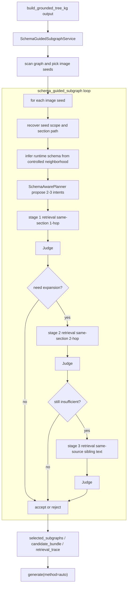

# Schema-Guided Subgraph Sampler

## 导读

本文说明新增的 `schema_guided_subgraph` 算子，以及它和现有两条 agentic subgraph 链路的关系。

它对应的 pipeline 是：

```text
read
-> structure_analyze
-> hierarchy_generate
-> tree_construct
-> tree_chunk
-> build_grounded_tree_kg
-> schema_guided_subgraph
-> generate(method=auto)
```

对应示例配置见：

- `examples/generate/generate_vqa/schema_guided_subgraph_config.yaml`

它的目标不是替代：

- `sample_subgraph` 的 `Planner -> Assembler -> Judge`
- `sample_subgraph_v2` 的 `Editor -> Judge` graph editing loop

而是在两者之外补上一条更偏“受控检索”的路径：

- 保持 `image seed` 中心化
- 保持输出兼容 `generate(method=auto)`
- 借鉴 GraphRAG 的 `schema-aware decomposition`、`type-filtered retrieval`、`iterative reflection`
- 但不引入开放式全图 IRCoT 问答循环

## 1. 设计定位

这条链路更适合下面这种情况：

- 图像附近有不少 text / relation 证据，但一次性让 assembler 选图不够稳
- 我们希望 retrieval 行为更可控，而不是完全交给 LLM 自由拼图
- 我们希望在“不改现有 generate”的前提下，额外引入轻量 schema 约束

它和另外两条链路的区别可以概括成：

- `sample_subgraph`
  - 偏单轮 candidate assembly
  - LLM 决定“从 neighborhood 里拿哪些节点边”
- `sample_subgraph_v2`
  - 偏状态式 graph editing
  - LLM 决定“如何编辑当前 candidate state”
- `schema_guided_subgraph`
  - 偏 schema-guided retrieval
  - LLM 主要决定“该检索哪类实体/关系/证据”，而具体扩图顺序由代码控制

## 2. 主流程

实现文件：

- `graphgen/operators/schema_guided_subgraph/schema_guided_subgraph_service.py`
- `graphgen/models/subgraph_sampler/schema_guided_vlm_sampler.py`
- `graphgen/models/subgraph_sampler/schema_guided_prompts.py`

整体流程如下：



## 3. Runtime Schema Inference

这里的 schema 不是外部文件，而是 runtime inference。

`SchemaGuidedVLMSubgraphSampler.sample()` 会先从 seed 恢复两类约束：

- `seed_scope`
  - 来自 `node.source_id` 和 `metadata.source_trace_id`
- `seed_section`
  - 来自 `metadata.path` 或 `node.path`

然后用一个受控 neighborhood 统计出轻量 schema：

- `node_types`
- `relation_types`
- `modalities`
- `section_paths`

这个 `inferred_schema` 主要有两个用途：

1. 给 planner 看，让 planner 产生更具体的意图和 target type。
2. 写进输出结果，方便后续分析 agent 到底“看到了什么 schema”。

需要注意：

- 它不是全局 schema registry
- 也不做 schema evolution
- 只是一份 seed-local、runtime-only 的轻量结构摘要

## 4. Planner 与 Intent Bundle

`SchemaAwarePlanner` 不分解用户问题，因为这里没有外部 user query。

它做的是：

- 围绕某个 `image seed`
- 提出 2-3 个“值得出题”的技术 intent
- 每个 intent 同时带上 retrieval hint

planner 期望返回的字段包括：

- `intent`
- `technical_focus`
- `question_types`
- `priority_keywords`
- `target_node_types`
- `target_relation_types`
- `required_modalities`
- `evidence_requirements`

这些 intent 会被保存在结果里的：

- `intent_bundle`

所以这条链路的 planner 更像：

- “schema-aware retrieval planner”

而不是：

- “直接构图器”

## 5. Dual-Path Retrieval

这里说的 dual-path，不是外部向量库的全图双路召回，而是当前 KG 内部的两类证据路径：

### 5.1 图路径

图路径只从当前受控 neighborhood 里拿：

- node
- edge
- relation evidence

它主要负责：

- 保住显式图结构
- 保住 image-centered connectivity
- 给 downstream `generate(auto)` 提供正式 `nodes/edges`

### 5.2 证据路径

证据路径不是另建外部检索器，而是补充：

- 同 section 的 text evidence
- 或同 source 的 sibling text node

它主要解决的问题是：

- 单靠局部 edge 不一定闭合
- 图像说明、caption、notes、临近段落可能没完全连成好看的小图
- 但这些 text node 仍然对问题可答性很重要

因此这条链路允许：

- 用显式子图承载结构
- 用额外 text node 提升 evidence closure

## 6. Reflection Loop

反思回路不是开放式 IRCoT，而是固定的 retrieval broadening。

当前顺序是：

1. `same_section_one_hop`
2. `same_section_two_hop`
3. `same_source_sibling_text`

Judge 如果返回 `needs_expansion=true`，才会进入下一阶段。

这样设计的原因是：

- 先保守，优先保住局部 section 内的闭合结构
- 再扩 hop
- 最后才补 sibling text

当前明确不做：

- 全图开放搜索
- 无界迭代 query rewriting
- 独立向量索引 / FAISS retrieval service

## 7. 输出契约

顶层输出保持兼容：

- `seed_node_id`
- `seed_image_path`
- `selection_mode`
- `degraded`
- `degraded_reason`
- `selected_subgraphs`
- `candidate_bundle`
- `abstained`

另外新增了调试 / 分析字段：

- `inferred_schema`
- `intent_bundle`
- `retrieval_trace`
- `termination_reason`

其中：

- `selected_subgraphs`
  - 仍然是 downstream generator 会真正消费的正式 artifact
- `candidate_bundle`
  - 记录每个 stage 的 candidate judgement
- `retrieval_trace`
  - 记录每个 intent 在每个 retrieval stage 的扩张和 judge 决策

所以 `generate(method=auto)` 仍然不用改。

## 8. 关键参数

`schema_guided_subgraph.params` 里第一版最重要的参数是：

- `candidate_pool_size`
  - planner 最多提出多少 intent
- `max_selected_subgraphs`
  - 最多保留多少个 final selected subgraph
- `max_vqas_per_selected_subgraph`
  - 每个 selected subgraph 最多允许 downstream 保留多少道 QA
- `initial_hops`
  - 第一阶段 retrieval 的 hop 数
- `max_hops_after_reflection`
  - reflection 扩张后的最大 hop 数
- `hard_cap_units`
  - 最终 candidate 的 `node_count + edge_count` 上限
- `section_scoped`
  - 是否优先限制在 seed 所在 section/path
- `same_source_only`
  - 是否只允许 seed 同源证据
- `allow_type_relaxation`
  - 最后一阶段是否放宽 type 过滤
- `allow_degraded`
  - primary 全失败时是否允许 degraded session
- `judge_pass_threshold`
  - Judge 总分阈值

默认偏向离线质量优先。

## 9. 当前 review 结论

这一版实现我再 review 后，结论是：

- 没看到需要立刻返工的硬错误
- 主体逻辑和原设计一致
- 最需要强调的是“边界说明”，不是额外加功能

尤其要明确三点：

1. 这是受控 schema-guided retrieval，不是开放式 GraphRAG 问答代理。
2. sibling text 是补充 evidence closure，不是把全图 text 都拉进来。
3. 输出兼容 `generate(method=auto)`，因此新增字段目前主要服务调试和分析。

## 10. 当前限制

当前实现仍然有这些限制：

- planner 仍是单轮 JSON 协议，不是 tool-using runtime
- retrieval 仍是本地规则式过滤，不是 learned retriever
- sibling text 可能补进来的是弱连接证据，因此最终是否保留仍高度依赖 judge
- `candidate_bundle` 和 `retrieval_trace` 偏调试视角，还不是稳定对外协议
- 当前仍只围绕 `image seed`，没有扩展到纯文本 QA

## 11. 推荐阅读顺序

如果你想从代码角度理解这条链路，建议按这个顺序看：

1. `graphgen/operators/schema_guided_subgraph/schema_guided_subgraph_service.py`
2. `graphgen/models/subgraph_sampler/schema_guided_vlm_sampler.py`
3. `graphgen/models/subgraph_sampler/schema_guided_prompts.py`
4. `graphgen/operators/generate/generate_service.py`
5. `examples/generate/generate_vqa/schema_guided_subgraph_config.yaml`
